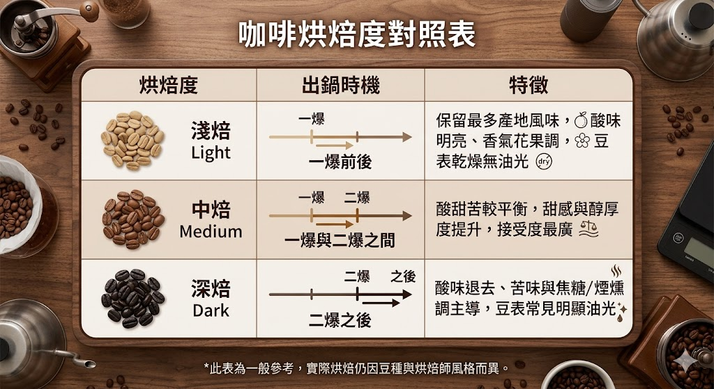
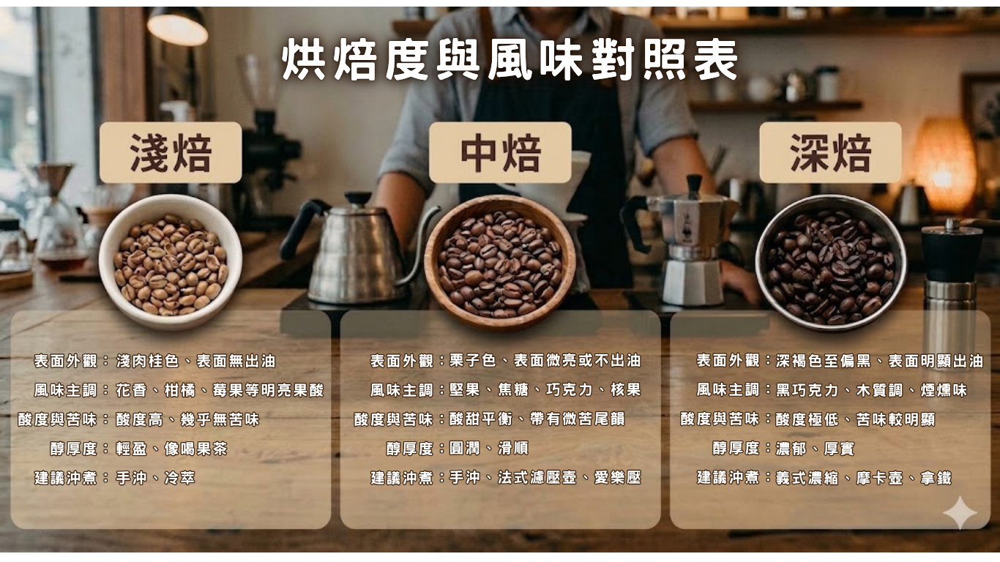

<!DOCTYPE html>
<html lang="zh-TW">
<head>
<meta charset="UTF-8">
<meta name="viewport" content="width=device-width, initial-scale=1.0">
<title>咖啡烘焙度解析｜淺焙、深焙差異？</title>

</head>
<body>

<article class="container">
  
  
咖啡豆 · 入門版

  <h1>咖啡烘焙度解析｜淺焙、深焙差異？風味、酸苦與沖煮一次搞懂</h1>
  
  

     撰文：C&C解憂室
  

  

  <section class="tldr">
    <h2>☕ 咖啡烘焙度決定了風味裡的酸苦與醇厚度</h2>
    
<strong>淺焙</strong>保留產地花果酸香（適合手沖）；<strong>中焙</strong>風味平衡百搭；<strong>深焙</strong>帶有焦糖與醇厚苦甜（適合加奶）。烘焙度越深，產地原本的風味就越不明顯。

  </section>
  
  
買咖啡豆時，包裝上的「淺焙、中焙、深焙」是影響風味的關鍵指標。烘焙度不僅決定豆子的顏色，更直接決定了咖啡的酸值、甜感、醇厚度，以及適合的沖煮器具。本文以最簡明的結構，帶您一次搞懂烘焙度的差異與挑豆小秘訣。

  
  

    
📝 文章目錄

    <ul style="list-style-type: none; padding-left: 0; margin: 0; line-height: 2;">
      <li><a href="#section-1">一、什麼是咖啡烘焙度？</a></li>
      <li><a href="#section-2">二、淺、中、深焙的風味差異</a></li>
      <li><a href="#section-3">三、專業指標：Agtron 數值（咖啡的專屬色票）</a></li>
      <li><a href="#section-4">四、破解 6 個超常見的咖啡日常小迷思</a></li>
      <li><a href="#section-5">五、手沖咖啡–水溫決定風味！黃金沖煮溫度解析</a></li>
    </ul>
  

  <h2 id="section-1">一、什麼是咖啡烘焙度？</h2>
  
烘焙是生豆透過加熱產生化學反應（水分蒸發、焦糖化、梅納反應）的過程。烘焙時間越長、溫度越高，豆色越深，風味越偏向焦糖與煙燻；烘焙時間越短，則保留越多生豆原有的花果酸香。

  
  
烘豆師常以咖啡豆的「爆裂聲」作為判斷烘焙度的重要指標：

  <ul>
    <li><strong>一爆（First Crack）：</strong>聽起來像是在炸爆米花一樣清脆！這代表水分正在大量散失。喜歡帶有明亮果酸的「淺焙咖啡」，通常在這個時候就會準備起鍋。</li>
    <li><strong>二爆（Second Crack）：</strong>聲音會變得比較細碎、密集，這時候豆子表面會開始滲出亮晶晶的油脂。喜歡濃郁厚實、帶有可可苦甜味的「深焙咖啡」，就是要等聽到這個聲音才算大功告成。</li>
  </ul>
  
  <figure> 
      
    <figcaption><strong>烘焙過程決定了一杯咖啡風味的走向</strong></figcaption>
    
就像我們在廚房烤餅乾或煎牛排一樣。隨著溫度慢慢升高，豆子內部會開始一場神奇的「變身秀」。

    
回想一下烤麵包或是煎肉排時散發出的那種誘人香氣，就是這個原理！它會幫咖啡豆逼出迷人的堅果、烤餅乾和巧克力香味。接著，當溫度繼續飆高，豆子裡的糖分會開始「焦糖化」，把原本生澀的味道，轉變成像太妃糖、黑糖那樣濃郁的甜感；如果烤得再久一點，就會開始帶有一點焦苦味。

    
有趣的是，咖啡豆天生帶有的「水果酸味」，會隨著烘焙時間拉長而越來越少。所以，如果喜歡像水果茶那樣清爽、酸酸甜甜的口感，就要選烘烤時間短一點的「淺焙」；如果喜歡味道濃郁、帶有苦甜厚實感的咖啡，那就得選烤久一點的「深焙」。

    
烘焙並不是憑空變出味道，而是烘豆師在玩一場「酸與苦的翹翹板遊戲」，用火候把每一支咖啡豆最迷人的個性給逼出來！

  </figure>
  
  <h2 id="section-2">二、淺、中、深焙的風味差異</h2>
  
風味走向可用「酸→苦」來區分：

   

  
<strong>烘焙度會覆蓋產地風味。越淺焙越能喝出產地特色，越深焙則產地差異越小。</strong>

  
把咖啡生豆想像成來自不同國家的高級食材。比如衣索比亞的豆子，天生帶有優雅的茉莉花和柑橘香氣；而肯亞的豆子，則有著明亮的黑莓果酸。

  
如果我們用輕柔的「清炒」方式（淺焙），你可以非常清楚地品嚐出每一種食材原本的鮮甜與獨特個性。但如果我們用「炭烤」方式（深焙），那麼無論原本是哪裡來的頂級豆子，最後喝起來多半都會是濃郁的焦糖、可可或煙燻味，原本細緻的花果香就被完全掩蓋過去了。

  
這也是為什麼主打「精品咖啡」的店家，通常會選擇淺焙或中淺焙！因為他們希望喝到的是這支豆子專屬的「產地風土（Terroir）」，而不是千篇一律的烘烤味。所以，下次買了極具特色的莊園豆，記得挑選淺焙，才不會辜負了它的好味道喔！

  
  <h2 id="section-3">三、專業指標：Agtron 數值（咖啡的專屬色票）</h2>
  
有時候，每家咖啡店對「淺焙」或「深焙」的主觀認定都不太一樣。為了避免標準不一，專業烘豆師會使用儀器掃描咖啡豆，測出一個客觀的 <strong>Agtron 數值</strong>。

  
你可以把它想成是給咖啡豆的「明亮度打分數」，分數越高，代表豆子顏色越淺：

  <ul>
    <li><strong>70分以上（淺焙）：</strong>豆子顏色很淺，保留了最多原生的花果酸甜。</li>
    <li><strong>55–65分 （中焙）：</strong>呈現漂亮的栗子色，酸甜平衡，最平易近人。</li>
    <li><strong>45分以下（深焙）：</strong>豆子顏色偏深棕色甚至表面出油，味道濃郁厚實。</li>
  </ul>
  
  <h2 id="section-4">四、破解 6 個超常見的咖啡日常小迷思</h2>
  <ul>
    <li>
      <strong>迷思 1：深焙咖啡看起來很濃，所以咖啡因比較高？</strong> 
      
這誤會可大了！其實咖啡豆在高溫烘烤的過程中，咖啡因反而會微幅流失。所以在相同重量下，<strong>淺焙咖啡的咖啡因其實比深焙還要稍微高一點點</strong>喔！真正決定咖啡因濃度的關鍵，其實是你的「咖啡粉量」與「沖泡時間」。

    </li>
    <li>
      <strong>迷思 2：咖啡豆表面油油亮亮的，代表很新鮮？</strong> 
      
這要看你是買哪一種豆子！深焙豆因為烘烤時間長，內部的油脂被逼到表面，出油是正常現象。但如果你買的是<strong>淺焙或中焙豆，表面卻泛著油光，那反而是豆子放太久、油脂氧化的不新鮮警訊</strong>。

    </li>
    <li>
      <strong>迷思 3：淺焙咖啡喝起來很酸，是不是豆子烘壞了？</strong> 
      
不一定喔！淺焙咖啡的「酸」，是烘豆師刻意為你保留下來的優質水果酸甜，喝起來應該像水果茶一樣清爽順口。如果你喝到的是那種<strong>讓人皺眉頭、尖銳單薄的「死酸味」</strong>，通常不是豆子的錯，而是沖煮時水溫太低或時間太短（萃取不足）所造成的！

    </li>
    <li>
      <strong>迷思 4：咖啡豆怕壞掉，放冰箱保存最保鮮？</strong> 
      
千萬別這麼做！冰箱裡的「水氣」跟「異味」是咖啡豆的頭號殺手。當你把冷冰冰的豆子拿出來室溫沖泡時，表面凝結的水滴會立刻讓咖啡豆受潮變質；而且豆子就像海綿一樣會吸味道，一不小心就會泡出一杯「大蒜或剩菜風味」的咖啡！其實，只要裝在有單向排氣閥的密封袋裡，放在<strong>陰涼、乾燥、不被太陽直射的地方</strong>就非常足夠囉。

    </li>
    <li>
      <strong>迷思 5：義式濃縮（Espresso）超濃超苦，所以咖啡因最高？</strong> 
      
這也是個超級常見的錯覺！雖然義式濃縮喝起來味道極其強烈，但因為它的沖泡時間非常短（大約只要 20-30 秒），咖啡因反而來不及完全釋放。如果以「單杯飲用量」來比較，你手裡那杯慢慢滴漏、沖泡時間長達 2 到 3 分鐘的<strong>「手沖咖啡」或「大杯美式」，喝下肚的咖啡因總量通常會比濃縮咖啡高出許多喔！</strong>

    </li>
    <li>
      <strong>迷思 6：泡咖啡就是要燙，一定要用剛燒開的沸水沖？</strong> 
      
先等等，別急著倒水！剛燒開的 100°C 滾水會直接把嬌貴的咖啡粉「燙傷」，不僅會把優雅的花果香氣全數破壞，還會溶解出難以下嚥的焦苦與澀味。就像我們在第五點提到的，最完美的水溫其實是落在 <strong>85°C 到 95°C 之間</strong>，稍微放涼一下下的熱水，才能泡出最溫潤的好味道。

    </li>  
  </ul>
  
  <h2 id="section-5">五、手沖咖啡–水溫決定風味！不同烘焙度的黃金沖煮溫度解析</h2>
  <figure> 
     
    <figcaption><strong>烘焙度對應的黃金沖煮水溫</strong></figcaption>
  </figure>
  
  
買對了豆子，如果配上錯誤的水溫，很容易就會把咖啡泡壞喔！記住這個大原則：「烘焙越淺，水溫越高；烘焙越深，水溫越低」：

  <ul>
    <li><strong>淺焙（建議水溫 92–95°C）：</strong>因為豆子質地較堅硬，需要用比較高的水溫，搭配稍微細一點的研磨，才能把隱藏在裡面的花果香氣完美激發出來。</li>
    <li><strong>中焙（建議水溫 90–92°C）：</strong>容錯率最高！只要用適中的水溫，就能沖出酸甜平衡的好味道，是剛接觸手沖的新手最不容易失敗的安全牌。</li>
    <li><strong>深焙（建議水溫 85–90°C）：</strong>因為深焙豆的物質非常容易溶出，強烈建議把水溫降低，以免「過度萃取」，把不舒服的焦澀苦味也一起泡出來。</li>
  </ul>

  

    
想品嚐咖啡豆最純粹的天生個性，請選「淺焙」；追求酸甜適中的順口平衡，請選「中焙」；如果喜歡加入牛奶做成濃郁拿鐵，那醇厚的「深焙」絕對是首選。

    
<strong>沒有哪一種烘焙度是絕對的完美，只要能找到你最喜歡的味道，那就是一杯最好的咖啡！</strong>

  

</style>

  

  
※ 本文內容為咖啡風味與沖煮的一般性知識整理，文中烘焙、溫度、數值為建立概念用的參考範圍，非絕對標準。

  <footer class="site">咖啡世界知識系列 · © 咖啡學習社</footer>

</article>

</body>
